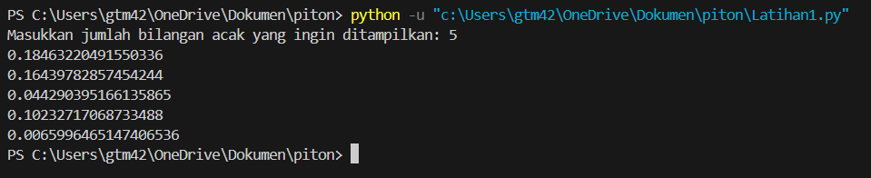
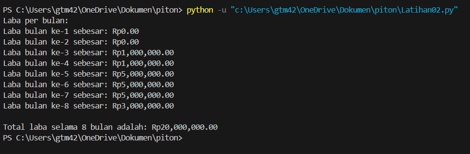
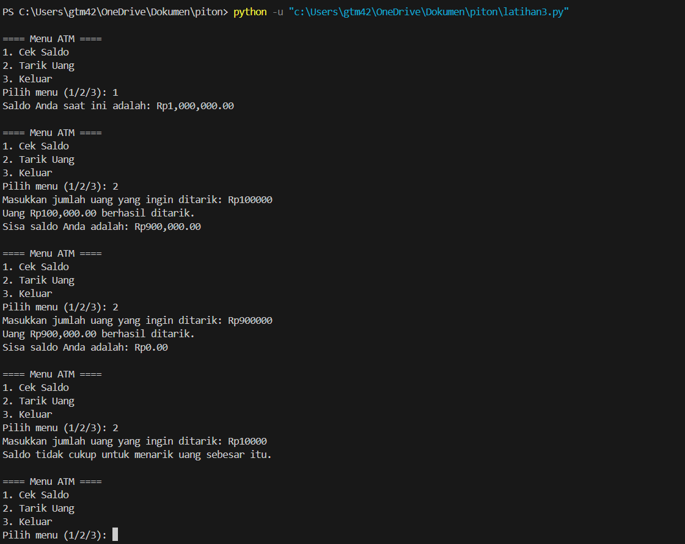

# Program Latihan: Penjelasan Alur Algoritma

## Deskripsi Program

Program ini terdiri dari 3 latihan yang berbeda, yaitu:
1. **Latihan 1**: Menampilkan bilangan acak yang lebih kecil dari 0.5.
2. **Latihan 2**: Menghitung total keuntungan dari modal awal berdasarkan perubahan laba setiap bulan.
3. **Latihan 3**: Mensimulasikan mesin ATM sederhana dengan saldo awal dan transaksi penarikan.

## 1. Latihan 1: Menampilkan Bilangan Acak yang Lebih Kecil dari 0.5

### Alur Algoritma:
1. Program meminta input dari pengguna berupa jumlah bilangan acak yang ingin ditampilkan (`n`).
2. Program menghasilkan bilangan acak menggunakan `random()`, yang akan bernilai antara 0 dan 1.
3. Program akan memeriksa apakah bilangan acak yang dihasilkan lebih kecil dari 0.5.
4. Jika bilangan acak lebih kecil dari 0.5, bilangan tersebut akan ditampilkan.
5. Proses ini diulang hingga jumlah bilangan acak yang diminta tercapai.
6. Program akan berhenti setelah menampilkan `n` bilangan acak yang memenuhi kriteria.

### Screenshot Hasil:

---

## 2. Latihan 2: Menghitung Total Keuntungan Usaha dengan Modal Awal

### Alur Algoritma:
1. Program dimulai dengan modal awal sebesar Rp 1.000.000.
2. Program akan menjalankan simulasi selama 8 bulan dengan keuntungan yang berubah-ubah.
   - Bulan 1 dan 2: Tidak ada laba.
   - Bulan 3 dan 4: Laba sebesar 1% dari modal.
   - Bulan 5 hingga 7: Laba meningkat menjadi 5% dari modal.
   - Bulan 8: Laba menurun menjadi 3% dari modal.
3. Setiap bulan, modal akan diperbarui dengan menambahkan laba yang diperoleh.
4. Program menghitung total keuntungan yang diperoleh selama 8 bulan.
5. Program menampilkan total keuntungan yang didapatkan setelah 8 bulan.

### Screenshot Hasil:

---

## 3. Latihan 3: Mesin ATM Sederhana

### Alur Algoritma:
1. Program dimulai dengan saldo awal sebesar Rp 1.000.000.
2. Program menampilkan menu pilihan dengan opsi:
   - Cek saldo saat ini.
   - Tarik uang (dengan batasan saldo yang tersedia).
   - Keluar dari program.
3. Program meminta input pilihan dari pengguna:
   - **Pilihan 1**: Menampilkan saldo saat ini.
   - **Pilihan 2**: Meminta jumlah uang yang ingin ditarik, memeriksa apakah saldo cukup, dan jika cukup, mengurangi saldo dan menampilkan sisa saldo.
   - **Pilihan 3**: Keluar dari program.
4. Program akan terus berjalan hingga pengguna memilih untuk keluar.
5. Program menampilkan pesan terima kasih ketika keluar.

### Screenshot Hasil:
